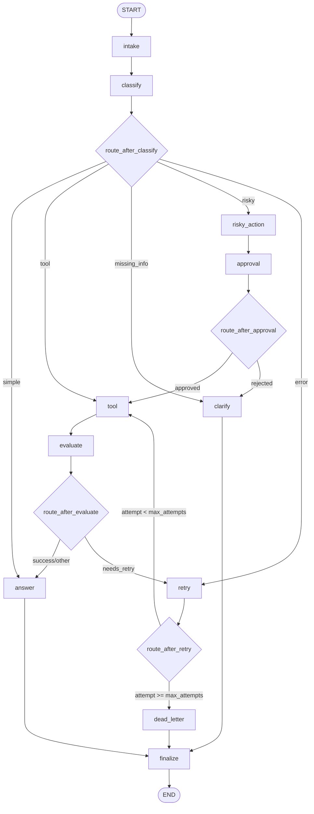

# Day 23 LangGraph Full-Score + Bonus Design

**Date:** 2026-08-25  
**Repository:** `tanh1c/Track3-DAY23-2A202601755-ChuNguyenTuanAnh`  
**Target branch:** `feat/day23-full-score-bonus`  
**Goal:** complete the Day 23 Track 3 LangGraph Agentic Orchestration lab to satisfy the official Codelab HTML contract first, then add high-value extensions with explicit evidence without destabilizing the core graph.

## 1. Source-of-truth hierarchy

Implementation decisions must follow this order:

1. Official VLearn Codelab HTML for `day-23-track-3-langgraph-agentic-orchestration` (updated 2026-08-24).
2. Repository contracts: public tests, docstrings, state/routing/graph scaffolds, `docs/RUBRIC.md`, README, sample config.
3. Bonus enhancements, only when they do not change required core behavior.

No extension is allowed to weaken bounded retry, approval gating, persistence semantics, metrics integrity, or termination.

## 2. Success criteria

The finished submission must satisfy all core requirements before bonus work is considered complete:

- Correct state fields and reducer semantics.
- All ten TODO nodes implemented.
- All four routing functions implemented.
- StateGraph contains the required eleven nodes.
- Classifier uses a real LLM with structured output.
- Answer node uses a real LLM grounded in current state/tool/approval context.
- No hard-coded sample scenario IDs or exact sample-query lookup tables.
- Retry is bounded and dead-letter behavior is correct.
- Risky actions are gated by approval before tool execution.
- Rejected approval routes to clarification.
- Every terminal path passes through `finalize` before `END`.
- A checkpointer is used with stable `thread_id`.
- Persistence/recovery has executable evidence, not only configuration.
- `outputs/metrics.json` validates and contains meaningful measured values.
- `reports/lab_report.md` is complete and internally consistent with metrics.
- Report contains at least two concrete failure modes.
- No secrets or hidden grading data are committed.
- Ruff, MyPy, tests, scenario runner, metrics validation, and diff hygiene pass at the final gate.

Target grading posture: **100/100 core first, then bonus extensions with test/report evidence.**

## 3. Required graph architecture

The graph must preserve the official target flow:



The four routing helpers are edge-decision functions, not graph nodes.

### Classification priority

When a query contains multiple signals, classification must obey:

`risky > tool > missing_info > error > simple`

The classifier prompt must describe semantic intent and this priority. It must not include `scenario_id` as a decision feature.

## 4. State design

`AgentState` remains `TypedDict(total=False)` and nodes return partial updates only.

### Existing scalar/current-value fields

- `thread_id`
- `scenario_id`
- `query`
- `route`
- `risk_level`
- `attempt`
- `max_attempts`
- `final_answer`

### Existing append-only reducer fields

- `messages`
- `tool_results`
- `errors`
- `events`

Only these history lists use append reducers.

### Required added fields

- `evaluation_result`: overwrite with `success` or `needs_retry`.
- `pending_question`: overwrite with the current clarification question.
- `proposed_action`: overwrite with the risky action awaiting decision.
- `approval`: overwrite with a plain serializable mapping compatible with `ApprovalDecision`.

### State invariants

- Nodes must not mutate incoming list objects with `.append()` and then return them.
- Nodes return only newly added history entries for reducer-managed lists.
- Scalars/current-value fields overwrite.
- `route` remains the original classified input route for metrics. `finalize` must not rewrite it to `done`; `dead_letter` must not rewrite it to `dead_letter` merely because that node was visited.
- State remains serializable for checkpointers.

## 5. Node contracts

### `intake`

Keep starter behavior as the reference partial-update pattern: trim query, append one message, append one event.

### `classify`

Primary path uses `get_llm().with_structured_output(...)` or provider-equivalent structured output with a Pydantic schema restricted to the five input routes plus risk metadata.

Requirements:

- Use semantic intent, not exact sample lookup.
- Enforce route priority.
- `risk_level=high` for risky behavior; otherwise low unless schema gives a justified equivalent.
- Record a normalized event.
- On provider/structured-output failure, use an explicit auditable failure policy rather than silently fabricating success.

### `tool`

Tool behavior remains deterministic and generalizable for the lab contract:

- Read `route`, `attempt`, query, and approved risky-action context where applicable.
- For the required error simulation, `route == "error"` with attempts below the starter threshold produces a result containing `ERROR`; otherwise produce a mock success result.
- Append exactly one new tool result and one event.
- Never execute a risky action before approval.

### `evaluate`

Base contract reads the latest tool result and sets `evaluation_result` to `needs_retry` or `success`.

Bonus design upgrades this to LLM-as-judge while preserving a deterministic fallback so provider timeout/error cannot create an unbounded loop or make CI nondeterministic.

### `answer`

Must call the real configured LLM and ground the prompt in:

- normalized query;
- relevant tool results;
- proposed action/approval context when present;
- relevant workflow limitations.

The generated answer must not claim a rejected action was performed. Record success/failure in the event trail.

### `clarify`

Generate a concise question using current query and, on rejection path, approval comment/proposed action when useful. Set both `pending_question` and a user-facing final response if the starter contract expects it.

### `risky_action`

Create `proposed_action` only. It must not perform the tool/side effect.

### `approval`

Core/default behavior remains non-interactive and test-safe: mock approval compatible with `ApprovalDecision`, with `approved=True` by default.

Bonus real HITL mode is enabled only when an explicit feature flag is set. CI default never waits for human input.

### `retry_or_fallback`

This node owns the retry counter.

Invariant: **only this node increments `attempt`, exactly once per visit.**

It appends one retry error/history entry and one retry event.

### `dead_letter`

Return an escalation/failure final answer with retry evidence. It has only a fixed edge to `finalize`.

### `finalize`

Append the official finalize completion event. Do not overwrite the classified route.

## 6. Retry and dead-letter semantics

Routing after `retry_or_fallback` uses the updated attempt value:

- `attempt < max_attempts` -> `tool`
- `attempt >= max_attempts` -> `dead_letter`

The error input route begins at `retry`, not directly at `tool`.

Critical regression case: sample `S07_dead_letter` has `max_attempts=1`. Starting at `attempt=0`, the first retry must produce `attempt=1`, then route immediately to `dead_letter`; it must not call the tool.

No recursion-limit increase may be used to conceal incorrect graph wiring.

## 7. LLM provider and environment design

Keep the existing provider factory and its documented priority:

1. Gemini via `GEMINI_API_KEY`
2. OpenAI via `OPENAI_API_KEY`
3. Anthropic via `ANTHROPIC_API_KEY`

`LLM_MODEL` may override the default model.

### Local `.env`

The starter currently uses `os.getenv()` but does not guarantee `.env` loading. Add `python-dotenv` and load environment variables exactly once at an appropriate entry/factory boundary.

Never load `.env` repeatedly inside nodes.

### Secret safety

- No key values in source, fixtures, screenshots, reports, metrics, workflow inputs, logs, or Git history.
- `.env` remains ignored.
- Tests should mock LLM calls where possible.
- Live smoke/scenario runs are explicit because they can consume API quota.

## 8. Persistence and recovery

### Core/default

`MemorySaver` remains supported for lightweight tests.

### Durable extension

Implement SQLite using `langgraph-checkpoint-sqlite` with a stable database path and safe SQLite connection configuration, including WAL where compatible.

Required evidence:

- graph compiled with durable checkpointer;
- stable `thread_id` reused;
- checkpoint/state history can be read;
- a recovery/resume test proves state is available across a fresh checkpointer/graph instance, representing process restart semantics.

`resume_success` may only be set true when such evidence is actually produced.

Postgres is deliberately out of the default implementation scope because SQLite is enough to satisfy durable persistence/recovery evidence with less infrastructure risk.

## 9. Metrics design

Preserve repository schemas but replace placeholder semantics with measured evidence.

### Required instrumentation

- Measure wall-clock scenario latency with `time.perf_counter()` around each graph invocation.
- Derive nodes visited consistently from the event trail.
- Count retries from retry events/visits.
- Distinguish approval-node visit from real interrupt/resume when HITL mode is enabled.
- `approval_observed` reflects actual approval state presence/decision.
- `resume_success` is computed from real durable-recovery evidence, not hard-coded.

The generated JSON must contain at least the public scenario count threshold required by validation and must pass Pydantic parsing.

Metrics and report values must come from the same runtime evidence; do not hand-edit report numbers independently.

## 10. Report design

`render_report()` produces a deterministic Markdown report with:

1. Student identity metadata, repository/commit/date, without secrets.
2. Architecture summary and eleven-node graph/termination explanation.
3. State schema and reducer rationale.
4. Aggregate metrics table.
5. Per-scenario results.
6. Retry/approval/recovery evidence.
7. At least two concrete failure analyses.
8. Implemented extension evidence only.
9. Improvement plan separating completed core from future production work.

Minimum failure modes to analyze:

- tool/error failure -> bounded retry -> success or dead-letter containment;
- risky action -> approval gate -> rejected/approved outcome without unauthorized execution.

The report must not overstate interrupt/recovery/latency capabilities beyond actual instrumentation.

## 11. Bonus extension set

Extensions are implemented only after the core checklist is stable and each extension must have a test or report proof.

### 11.1 LLM-as-judge

Upgrade evaluator to structured verdict with:

- `verdict` (`success`/`needs_retry`);
- short `reason`;
- timeout/error fallback;
- simple cost guard so evaluation does not recursively or repeatedly spend tokens without bound.

Fallback must remain deterministic and auditable.

### 11.2 Real HITL interrupt/resume

Feature-gated, e.g. `LANGGRAPH_INTERRUPT=true`.

- Use LangGraph `interrupt()` at approval.
- Resume with the same `thread_id` and a reviewer decision.
- Keep mock approval as the default for tests and CI.
- Add explicit evidence distinguishing interrupt occurrence from mere approval-node visitation.

### 11.3 SQLite durable recovery

Described in the persistence section; includes restart-style recovery evidence.

### 11.4 Time travel

Expose a small helper/CLI path or testable function to:

- inspect state history;
- select an older checkpoint;
- replay/fork in a controlled manner.

No hidden mutation of the core scenario path.

### 11.5 Mermaid graph export

Export Mermaid from the actual compiled graph and store/report it as architecture evidence. The exported structure should be compared with the required target graph.

### Explicitly deferred extensions

Unless required later by evidence gaps, do not add by default:

- Postgres service;
- Streamlit UI;
- parallel `Send()` fan-out.

They add operational/merge/test complexity without improving the core score enough to justify the risk.

## 12. GitHub Actions design: manual CI only

The user explicitly wants to use GitHub Actions while avoiding repeated automatic runs.

Create one workflow, planned as `.github/workflows/manual-ci.yml`, with **only**:

```text
on: workflow_dispatch
```

It must not include `push`, `pull_request`, `schedule`, or other automatic triggers.

### Workflow modes

Use a manual input such as `mode` with two choices:

#### `static` (default)

Runs checks that should not require a live LLM key:

- dependency install;
- Ruff;
- MyPy;
- unit tests that mock LLM/provider behavior;
- routing/state/metrics/report/persistence unit tests as applicable;
- secret/TODO hygiene checks that do not call APIs.

#### `full-live`

Runs only when explicitly selected by the user and adds:

- graph smoke tests using the configured provider;
- sample scenario runner;
- metrics validation;
- report generation/consistency checks;
- durable recovery evidence tests;
- final diff/output/artifact checks that can run in CI.

### Action anti-spam controls

- `workflow_dispatch` only.
- Add workflow/job `concurrency` with `cancel-in-progress: true` so repeated manual starts do not stack indefinitely.
- Keep permissions minimal, normally `contents: read` unless an explicit write requirement is later justified.
- Use one Python version unless compatibility evidence requires more; no unnecessary matrix multiplication.
- Do not run all three LLM providers.
- Do not auto-run live API tests on commits or pull requests.

### GitHub Actions Secrets

Repository secret values are entered manually by the user under GitHub Actions settings. The workflow references them but never embeds values.

Supported names:

- `GEMINI_API_KEY`
- `OPENAI_API_KEY`
- `ANTHROPIC_API_KEY`
- optional non-secret `LLM_MODEL` can be configured as a repository variable or workflow environment value if desired.

Only one provider key should normally be exposed to a live run to avoid provider-priority confusion.

The current GitHub connector is not used to create/read secret values; secret setup remains a one-time user-side repository setting.

## 13. Testing strategy

Testing follows the contracts rather than modifying public tests.

### Public tests

Leave repository public tests unchanged. They remain external contracts.

### Additional student tests

Add focused tests for:

- state reducer/current-value semantics;
- no input-state mutation;
- all routing decision tables;
- retry counter ownership and boundary conditions;
- `S07`-equivalent generic dead-letter boundary without hard-coding scenario ID;
- risky action does not call tool before approval;
- approved and rejected approval routing;
- classifier structured-output schema with mocked LLM;
- classifier priority with unseen paraphrases via mocked semantic outputs/contracts;
- answer grounding with mocked LLM;
- evaluator structured verdict and deterministic fallback;
- report required sections and metric consistency;
- SQLite persistence and restart-style recovery;
- HITL feature flag leaves CI default non-interactive;
- Mermaid export availability/shape where stable.

### Live tests

Live provider tests are not the only proof of correctness. They are reserved for deliberate final/manual `full-live` validation because they are nondeterministic and cost money.

## 14. Implementation boundaries and expected touched files

Expected core files:

- `src/langgraph_agent_lab/state.py`
- `src/langgraph_agent_lab/nodes.py`
- `src/langgraph_agent_lab/routing.py`
- `src/langgraph_agent_lab/graph.py`
- `src/langgraph_agent_lab/llm.py`
- `src/langgraph_agent_lab/persistence.py`
- `src/langgraph_agent_lab/metrics.py`
- `src/langgraph_agent_lab/report.py`
- `src/langgraph_agent_lab/cli.py`
- `pyproject.toml`

Expected evidence/config files:

- `configs/lab.yaml` only if needed for supported checkpointer behavior without violating starter contract;
- `.github/workflows/manual-ci.yml`;
- additional tests under `tests/`;
- `outputs/metrics.json` generated from a real final scenario run;
- `reports/lab_report.md` generated/filled consistently;
- optional Mermaid evidence file if export is useful.

Do not add or recreate `data/grading/` or hidden grading content.

## 15. Final verification gate

Before claiming completion, run in this order where environment permits:

```text
ruff check src tests
mypy src
pytest -q
run-scenarios with configs/lab.yaml
validate-metrics on outputs/metrics.json
verify report/metrics consistency
scan for TODO(student)/NotImplementedError in required implementation paths
scan for accidental secrets
verify no hidden grading data
verify Git diff whitespace hygiene
```

Equivalent Make targets may be used where supplied by the starter.

The GitHub Actions `full-live` workflow is a deliberate manual verification path, not an automatic commit gate.

## 16. Acceptance conditions

The implementation is accepted only when all of the following are true:

- Required graph paths terminate through `finalize`.
- Five input routes generalize beyond exact sample strings.
- LLM classifier and answer requirements are genuine, not heuristic-only substitutions.
- Retry/dead-letter boundary is proven.
- Approval gate prevents risky pre-approval execution.
- Persistence/recovery proof is real.
- Metrics are measured and report is evidence-based.
- Core tests and quality gates pass.
- Manual CI exists without automatic triggers.
- Live provider run can consume a repository secret without disclosing it.
- Selected bonus extensions have isolated evidence and do not alter required core behavior.

## 17. Non-goals

- Recreating hidden grading scenarios.
- Modifying public tests to hide implementation defects.
- Increasing recursion limits to mask graph loops.
- Building a production support backend or real destructive refund/delete service.
- Running GitHub Actions on every push/PR.
- Storing API keys in Git-tracked files.
- Adding feature-heavy extensions merely for quantity.
